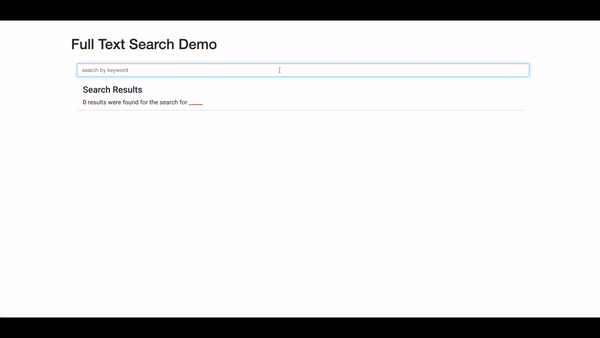

# mongodb-full-text-search-app



Demonstration of MongoDB's Full Text Search capability within a Flask web application

## Installation

1. Use the package manager [pip](https://pip.pypa.io/en/stable/) to install pymongo and flask.

```bash
pip install pymongo
pip install flask
```

2. Download the [sample_mflix collection](https://docs.atlas.mongodb.com/sample-data/sample-mflix/) from MongoDB Atlas

3. Create a `config.py` file with your `mongo_uri` connection string from Atlas.


## Usage

```bash
python manage.py
```
