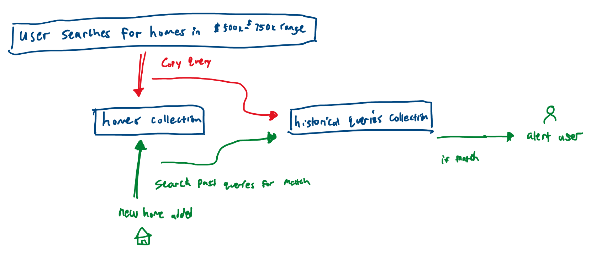

# Saved Searches with Matching Alerts

Applications often have the concept of "saved searches", where their users' historical queries are saved. An extension of this feature, is the ability to receive a notification when new "items" are added which match any of these historical, saved searches.

To put it more tangibly, let's say you run a real estate listing application. Your client is on the market for a house in the $500k - $750k range. Whenever they create a new search with different criteria, maybe one search includes a garage and the other has no HOA fees, you will be logging each of these deviations in a "historical queries" collection. Now whenever a new house is added to the homes collection, your system will search this new house through the entire historical queries collection, find any matches, and notify the user.




## Demo

### 1. Send queries to a new collection

Using PyMongo's Logger class, we will register our own logger via:

``` python
monitoring.register(QueryLogger())
```

So now, whenever a query is sent to the database, we are copying it in a new collection.


### 2. When new documents are inserted, search the logged queries collection

```python
watch
```
